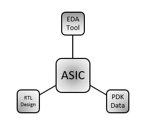

<h3 align="center"> Advanced Physical Design using OpenLANE Sky130</h3>

This GitHub repository will demonstrate the work done in Advanced-Physical-Design-using-OpenLANE-Sky130 workshop which is organized by VLSI System Design also called VSD. The main aim of this workshop is to give hands-on experiences on SoC design planning in OpenLANE flow using Google-SkyWater 130nm process design kit (pdk).

<!-- TABLE OF CONTENTS -->

  
Table of Contents

  <ol>
    <li>
      <a href="##Day 1 - Inception of open-source EDA, OpenLANE and Sky130 PDK">Day 1 - Inception of open-source EDA, OpenLANE and Sky130 PDK</a>
      <ul>
        <li><a href="#ASIC Design Flow">ASIC Design Flow</a></li>
        <li><a href="#Simplified RTL to GDSII">Simplified RTL to GDSII</a></li>
      </ul>
      </li>
    <li>
      <a href="#Day 2 - Good floorplan vs bad floorplan and introduction to library cells">Day 2 - Good floorplan vs bad floorplan and introduction to library cells</a>
      <ul>
        <li><a href="#Floorplan">Floorplan</a></li>
        <li><a href="#View-Placement-in-Magic">View Placement in Magic</a></li>
      </ul>
    </li>
    <li>
      <a href="#Day 3 - Design library cell using Magic Layout and ngspice characterization">Day 3 - Design library cell using Magic Layout and ngspice characterization</a>
      <ul>
        <li><a href="#Extraction to Spice using Magic">Extraction to Spice using Magic</a></li>
        <li><a href="#Spice Simulation">Spice Simulation</a></li>
      </ul>
    </li>
    <li>
      <a href="#Day 4 - Pre-layout timing analysis and importance of good clock tree">Day 4 - Pre-layout timing analysis and importance of good clock tree</a>
      <ul>
        <li><a href="#LEF File">LEF File</a></li>    
      </ul>
    </li>
    <li>
      <a href="#Day 5 - Final steps for RTL2GDS using tritonRoute and openSTA">Day 5 - Final steps for RTL2GDS using tritonRoute and openSTA</a>
      <ul>
        <li><a href="#Generating Power Distribution Network">Generating Power Distribution Network</a></li>
        <li><a href="#SPEF Extraction">SPEF Extraction</a></li>
      </ul>
      </li>
    
  </ol>
  

## Day 1 - Inception of open-source EDA, OpenLANE and Sky130 PDK
### ASIC Design Flow

### Simplified RTL to GDSII

#### Synthesis

#### Floorplanning

#### Placement

#### Clock Tree Synthesis 

#### Routing

#### Sign Off

## Day 2 - Good floorplan vs bad floorplan and introduction to library cells

## Day 3 - Design library cell using Magic Layout and ngspice characterization

## Day 4 - Pre-layout timing analysis and importance of good clock tree

## Day 5 - Final steps for RTL2GDS using tritonRoute and openSTA

