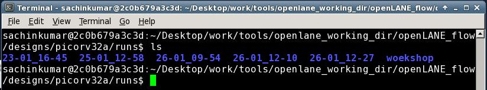
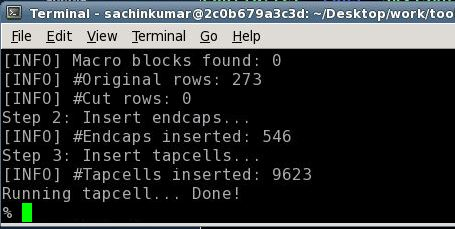
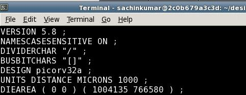
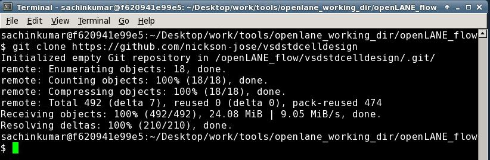
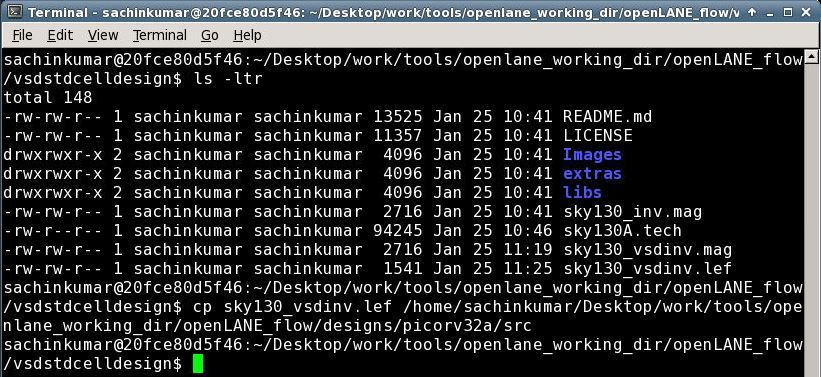
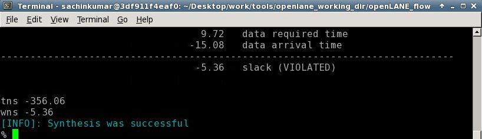
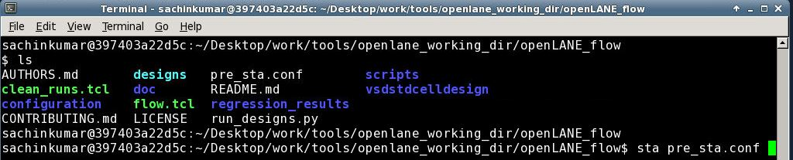

<h3 align="center"> Advanced Physical Design using OpenLANE Sky130</h3>

This GitHub repository will demonstrate the work done in Advanced-Physical-Design-using-OpenLANE-Sky130 workshop which is organized by VLSI System Design also called VSD. The main aim of this workshop is to give hands-on experiences on SoC design planning in OpenLANE flow using Google-SkyWater 130nm process design kit (pdk).

<!-- TABLE OF CONTENTS -->

  
Table of Contents

  <ol>
    <li>
      <a href="##Day 1 - Inception of open-source EDA, OpenLANE and Sky130 PDK">Day 1 - Inception of open-source EDA, OpenLANE and Sky130 PDK</a>
      <ul>
        <li><a href="#ASIC Design Flow">ASIC Design Flow</a></li>
        <li><a href="#OpenLANE Based on Serval Open Source Project for ASIC Design Flow">OpenLANE Based on Serval Open Source Project for ASIC Design Flow</a></li>
        <li><a href="#Google-SkyWater 130nm pdk">Google-SkyWater 130nm pdk</a></li>
        <li><a href="#OpenLANE">OpenLANE Introduction</a></li>
      </ul>
      </li>
    <li>
      <a href="#Day 2 - Good floorplan vs bad floorplan and introduction to library cells">Day 2 - Good floorplan vs bad floorplan and introduction to library cells</a>
      <ul>
        <li><a href="#Important Parameter related to floorplans ">Important Parameter related to floorplans </a></li>
        <li><a href="#Floorplan using OpenLANE">Floorplan using OpenLANE</a></li>
        <li><a href="#View Floorplan using Magic tool">View Floorplan using Magic tool</a></li>
        <li><a href="#Placement using OpenLANE">Placement using OpenLANE</a></li>
        <li><a href="#View Placement using Magic tool">View Placement using Magic tool</a></li>
      </ul>
    </li>
    <li>
      <a href="#Day 3 - Design library cell using Magic Layout and ngspice characterization">Day 3 - Design library cell using Magic Layout and ngspice characterization</a>
      <ul>
        <li><a href="#Cloning Design File from GitHUB Repository and Copy Tech File">Cloning Design File from GitHUB Repository and Copy Tech File</a></li>
        <li><a href="#Inverter Layout using Magic tool">Inverter Layout using Magic tool</a></li>
        <li><a href="#Extract Spice file using Magic tool">Extract Spice file using Magic tool</a></li>
        <li><a href="#Understanding of spice file using ngspice">Understanding of spice file using ngspice</a></li>
        <li><a href="#Characteristics of Inverter">Characteristics of Inverter</a></li>
      </ul>
    </li>
    <li>
      <a href="#Day 4 - Pre-layout timing analysis and importance of good clock tree">Day 4 - Pre-layout timing analysis and importance of good clock tree</a>
      <ul>  
        <li><a href="#PnR Guideline for Standard Cell Ports">PnR Guideline for Standard Cell Ports</a></li>   
        <li><a href="#Analysis of Inverter Layout using Magic tool">Analysis of Inverter Layout using Magic tool</a></li>   
        <li><a href="#Include Standard Cell into OpenLANE">Include Standard Cell into OpenLANE</a></li>
        <li><a href="#LEF File">LEF File</a></li> 
      </ul>
    </li>
    <li>
      <a href="#Day 5 - Final steps for RTL2GDS using tritonRoute and openSTA">Day 5 - Final steps for RTL2GDS using tritonRoute and openSTA</a>
      <ul>
        <li><a href="#Generating Power Distribution Network">Generating Power Distribution Network</a></li>
        <li><a href="#SPEF Extraction">SPEF Extraction</a></li>
      </ul>
      </li>
    
  </ol>
  

## Day 1 - Inception of open-source EDA, OpenLANE and Sky130 PDK

### ASIC Design Flow

### OpenLANE Based on Serval Open Source Project for ASIC Design Flow

#### Synthesis
- yosys :- Generates gate-level netlist.
- abc :- Performs cell mapping.
- OpenSTA :- Performs pre-layout STA.

#### Floorplanning
- init_fg :- Define the core area for macro as well the cell sites and tracks.
- ioplacer :- Place macro input/output ports.
- pdn :- Generates the prower distrubution network.

#### Placement
- RePLace :- Performs global placement.
- OpenDP :- Performs details placement.

#### Clock Tree Synthesis.
- TritonCTS :- Performes clock tree synthesis.

#### Routing
- FastRoute :- Performs global routing.
- TritonRoute :- Performs detailed routing.

#### Sign Off
- Magic :- Generates GDSII layout file from routed def.

### Google-SkyWater 130nm pdk

We used Google-SkyWater 130nm pdk. The pdks folder contains all the information related to process design kit (pdk). There are 3 sub-directories that can be accessed as follows:- 

1.	open_pdks :- Contains scripts that are used to bridge the gap between closed-source and open-source pdk to EDA tool compatibility.
2.	sky130A :- Contain open-source compatibility pdk files.
3.	skywater-pdk :- Contain foundry provide pdk related files.

sky130A contain two sub-directories:-

1.	libs.ref :- Contains process specific files. 

File nomenclature is as follows:
`sky130_fd_sc_hd`
- sky130 stands for process name
- fd stands for foundry name
- sc stands for standard cell
- hd stands for high density (variant of the pdk) 

2.	libs.tech :- Contain files specific to tools that we will  be using for end to end VLSI design.

The design that runs within OpenLANE are extracted from openLANE_flow/designs directory 

For this workshop, we will we using “picorv32a” design. The design hierarchy for picorv32a comes with follows components:-

- src directory  :- Contains Verilog files and sdc constaint files.
- config.tcl files :- Responsible for various design specific configuration switches and parameters which are used by OpenLANE flow tools. For example configuration file looks like this:-

### OpenLANE

Go to openLANE_flow directory and and type > ./flow.tcl > which run in docker that should be installed with OpenLANE tools.
To run OpenLANE interactively, type ./flow.tcl -interactive
To run OpenLANE in autonomous, type ./flow.tcl -design

OpenLANE requires different software to run it. So, run following command :-

`package require openlane 0.9` 

The keyword “prep” is used to preparing the design which effectively used by OpenLANE tools. Run command :-

`prep -design <design_name>` 

design_name = picorv32a

During the preparation stage of OpenLANE, the cell LEF and technology LEF information are combined and are collectively termed as merge.LEF

After Preparation complete look in openlane_flow/designs/picrov32a directory whare, we see runs directory is created.

Inside the runs directory we have directory with present date and time and inside this directory we have these directories:

The config.tcl file contains all the parameters used by OpenLANE for this specific run.

To do synthesis run command 

`run_synthesis`

After Synthesis complete look in openlane_flow/designs/picrov32a/runs/23-01_16-45/reports/synthesis directory where we see yosys_2.stat.rpt which we used for calculates flop ratio, buffer ratio etc.

## Day 2 - Good floorplan vs bad floorplan and introduction to library cells

### Important Parameter related to floorplans 

- A "die " which consists of "core" is small semiconductor material specimen on which the fundamental circuit is fabrication. Placed all logical cell inside the “core”.
- Netlist :- The connectively information between the gates is coded using VHDL/Verilog language is called as “netlist”
- Utilization Factor :- It is ratio of area occupied by netlist to total area of the core. When utilization factor is 1 then it means “core” is completely occupied. Ideally we don’t go with 100% utilization. We go with 50-60% utilization i.e., 0.5 or 0.6.
- Aspect ratio :- It is ratio of height of core to width of core. When aspect ratio is 1 then chip is in square shape.

### Floorplan using OpenLANE

The season started with introduction to keyword “tag” which used to provide user defined name to run. This is implement while preparing the design by following command: -

`prep -design <design_name> -tag <tag_name>`

Design_name = picorv32a and tag_name = woekshop

This creates new directory within designs/picorv32a/runs directory as “woekshop”.

Here, we change CLOCK_PERIOD variable

Then run synthesis.

To run floorplan in openLANE run following command: -

`run_floorplan`

Floorplan also runs as per the configuration settings present in the designs config.tcl files. 

After floorplan complete look in openlane_flow/designs/picrov32a/runs/woekshop/results/floorplan directory where we see "picorv32a .floorplan.def" file which contain information about core area and placement of cell sites.

`UNIT DISTANCE MICRONS 1000` represents 1000 data base unit per 1 Micron.

`DIEAREA ( 0 0 ) ( 1004135 766580 )` represents the placement of die as follows ( Lower_right_x-value Lower_left_y-value ) ( Upper_right_x-value Upper_right_y-value )

### View Floorplan using Magic tool

We require three file: -
-	Magic Technology file 
-	Magic lef file from preparation  stages
-	Floorplan generated def file

Use following command for viewing floorplan using magic tool

`magic -T <magic tech file> lef read <lef file> def read <def file>`
  
Here, magic tech file = sky130A.tech

lef file = merged.lef

def file = picorv32a.floorplan.def

Press s followed by v to select and view floorplan of whole design: -

  
### Placement using OpenLANE

Usually happens in two stages: -
-	Global Placement: - Main aim is optimization. This is done by reducing wire length by Half Perimeter Wire Length (HPWL).
-	Detail Placement: - Main aim is legalization.

To run placement is use following command: -

`run_placement`

 After Placement complete look in openlane_flow/designs/picrov32a/runs/woekshop/results/placement directory where we see picorv32a .placement.def file
 
### View Placement using Magic tool

We require three file: -

-	Magic Technology file 
-	Magic lef file from preparation  stages
-	Placement generated def file

Use following command for viewing floorplan using magic tool

`magic -T <magic tech file> lef read <lef file> def read <def file>`

Here, magic tech file = sky130A.tech
lef file = merged.lef
def file = picorv32a.placement.def

Press s followed by v to select and view floorplan of whole design: -

## Day 3 - Design library cell using Magic Layout and ngspice characterization

### Cloning Design File from GitHUB Repository and Copy Tech File

Use following command for clone design file from GitHUB repository to `openlan_working_dir/openLANE_flow` directory

`git clone https://github.com/nickson-jose/vsdstdcelldesign`

After cloning complete look in Desktop/work/tools/ openlan_working_dir/openLANE_flow directory where we see `sky130A_inv.mag` file.

Now, use following command for copy tech (i.e, sky130A.tech) file which is present in the `openlane_working_dir/pdks/sky130A/libs.tech/magic` directory, to the `vsdstdcelldesign` directory in openLANE_flow.

` cp sky130A.tech /home/sachinkumar/Desktop/work/tool/openlan_working_dir/openLANE_flow/vsdstdcelldesign`

### Inverter Layout using Magic tool

Use following command for viewing inverter using magic tool

`magic -T sky130A.tech sky130_inv.mag &`

### Extract Spice file using Magic tool

88Use following command in sequence on magic terminal for extraction of spice file

`extract all`
`ext2spice cthresh 0 rthresh 0`
`ext2spice`
  
 

Now go to `/Desktop/work/tools/openlsne_working_dir/openLANE_flow/vsdstdcelldesign` directory where we see `sky130_inv.ext` and `sky130_inv.spice` file.

#### Understanding of spice file using ngspice

Do some modification in ` sky130_inv.spice` file

Now open the `sky130_inv.spice` file using ngspice using following command: -
`ngspice sky130_inv.spice`

Now we can view the plot using following command

`plot y vs time a`

### Characteristics of Inverter

Rise Time: - It is time during transition, when output value switches from 20% to 80% of maximum value.

Fall Time: - It is time during transition, when output value switches from 80% to 20% of maximum value.

Propagation Delay: - It measured between 50% transition point of input and output waveform.

## Day 4 - Pre-layout timing analysis and importance of good clock tree

### PnR Guideline for Standard Cell Ports

-	Input and output port must be placed on vertical and horizontal tracks.

-	Width of standard cell must be odd multiple of track horizonal pitch and likewise height should an odd multiple of track vertical pitch.

`tracks.info` file which is present in `/Desktop/work/tools/openlane_working_dir/pdks/sky130A/libs.tech/openlane/sky130_fd_sc_hd` directory contains the offset and pitch information of different layers.

To view `tracks.info` file run following command: -

`less tracks.info`

Here, we observe the metal1 layer or horizontal layer is at an offset of 0.17 and pitch of 0.34. The metal2 layer or horizontal layer is at offset of 0.23 and pitch of 0.46 and so on.

### Analysis of Inverter Layout using Magic tool

Run following command to open layout of inverter using magic tool

`magic -T sky130A.tech sky130_inv.mag &`

To show the grids in magic tool use `grid` command magic terminal as shown in below and for any kind of help run `grid help` command

`grid 0.46um 0.34um 0.23um 0.17um`

Now to save this run following command in magic terminal

`save <file_name>`

Here, file_name = sky130_vsdinv.mag

This creates new file (i.e., sky130_vsdinv.mag) in `/Desktop/work/tools/openlane_working_dir/openLANE_flow/vsdstdcelldesign` directory

Now, open this new created layout file (i.e., sky130_vsdinv.mag) using magic tool.

Magic tool allows for user to create their cell lef  file. For this run command `lef write` in magic terminal

Now go to `/Desktop/work/tools/openlane_working_dir/openLANE_flow/vsdstdcelldesign` directory where we see new lef file is created (i.e., sky130_vdsinv.lef).

### Include Standard Cell into OpenLANE

Use following command to copy `sky130_vsdinv.lef` file into `/home/sachinkumar/Desktop/work/tools/openlane_working_dir/openLANE_flow/designs/picorv32a/src` folder

`cp sky130_vsdinv.lef/home/sachinkumar/Desktop/work/tools/openlane_working_dir/openLANE_flow/designs/picorv32a/src `

Also, copy all .lib files to `/home/sachinkumar/Desktop/work/tools/openlane_working_dir/openLANE_flow/designs/picorv32a/src`

Now come to `/home/sachinkumar/Desktop/work/tools/openlane_working_dir/openLANE_flow/designs/picorv32a` directory and edit `config.tcl` file.

Next, we need to prepare the design again using openLANE. For this we use following command 

`prep -design <design_name> -tag <tag_name> -overwrite`

Here design name = picorv32a

Tag name = 25-01_12-58

And “-overwrite” is significant for overwrites the new changes made in `config.tcl` file

Once preparation is complete we run following commands to include the additional lef file in flow: -

`set lefs [glob $::env(DESIGN_DIR)/src/*.lef]`
  
`add_lefs -src $lefs`

Next, we need to run synthesis.

Here, we observed Hold time is positive that’s means there is no hold time violations. And setup slack time is negative. Hence, there is setup time violation.

And chip area is

So, to fix this we set SYNTH_STRATEGY variable to 1 which indicates that we want to prefer more faster response as compared to low area. And set SYNTH_SIZING to 1 that indicates OpenLANE to prefer sizing of cells as compared to including buffer.

Next, run synthesis and after synthesis we get reduced slack value as compared to previous one.

Also, chip area gets increased

Now, run floorplan and then run placement.

### Layout of Placed Standard Cell Using Magic Tool

To view the placement of standard cell run following command 

`magic -T /home/sachinkumar/Desktop/work/tools/openlane_working_dir/pdks/sky130A/libs.tech/magic/sly130A.tech lef read ../../tmp/merged.lef def read picorv32a.placement.def &`

Now, we open the design using magic tool 

On zoom in and run command `expand` in magic terminal to see layout of standard cell.

### Fixing slack violation

For this we need configuration file which state library location and some initial condition.

Also need constraints file (here, my_base.sdc) which is followed by whole VLSI industry . So, copy this file to `/home/sachinkumar/Desktop/work/tools/openlane_working_dir/openLANE_flow/designs/picorv32a/src`

Do some modification to my_base.sdc file

Now run command `sta pre_sta.conf`

Here we get reduced slack

For further reduction in slack value, we need to reduced fan out. To do this run following command

`set ::env(SYNTH_MAX_FANOUT) 4`

And run synthesis

### Upsizing the cell

For further improvement in the slack value, we need to upsize the cell. 

To do this we replace the downsize cell with upsize cell. This is done using following command: -

` replace_cell _<net_number>_ <buffer_name>`

After this run following command to check the slack value

`report_checks -fields {net cap slew input_pins} -digits 4`

Now write this synthesis file after changes in buffer using following command.

`write_verilog /home/sachinkumar/designs/picorv32a/runs/ 25-01_12-58/results/synthesis/picorv32a.synthesis.v`

### Clock Tree Synthesis

Now, for clock tree synthesis run following command: - 

`run_cts`

After CTS complete look into `/Desktop/work/tools/openlane_working_dir/openLANE_flow/designs/picorv32a/runs/25-01_12-58/results/synthesis` directory where we see `picorv32a.synthesis.cts.v` is created 

### STA using OpenROAD

For timing analysis enter openROAD using command `openroad`

Here, we need to generate .db file which required lef and def files so run following command

For lef file use following command

`read_lef /openLANE_flow/designs/picorv32a/runs/25-01_12-58/tmp/merged.lef`

For def file use following command

`read_def /openLANE_flow/designs/picorv32a/runs/28-01_12-58/results/cts/picorv32a.cts.def`

Now use following command for further timing analysis

`read_verilog /designs/picorv32a/runs/28-01_12-58/results/synthesis/picorv32a.synthesis_cts.v`

`read_liberty $::env(LIB_SYNTH_COMPLETE)`

`link_design picorv32a`

`read_sdc /designs/picorv32a/runs/28-01_12-58/src/my_base.sdc`

`set_propagated_clock [all_clocks]`

`report_checks -path_delay min_max -fields {slew trans net cap input_pin} -format full_clock_expanded -digits 4`

## Day 5 - Final steps for RTL2GDS using tritonRoute and openSTA

